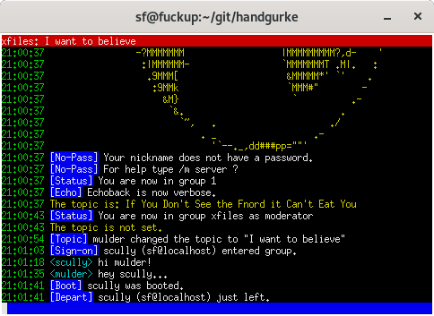

# Handgurke

Handgurke is a chat client for ICB. This project is at a very early stage.

You need at least Python 3.5 to start the client.

	$ python3.5 handgurke.py -s internetcitizens.band -n foxmulder -g xfiles

