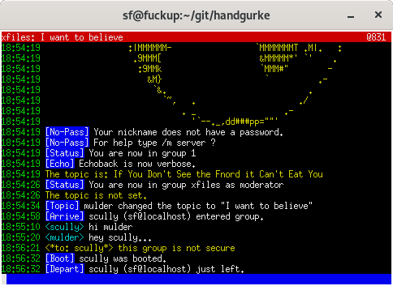

# Handgurke

Handgurke is a minimalistic chat client for ICB.

You need at least Python 3.5 to start the client.

	$ python3.5 handgurke.py --server internetcitizens.band --nick foxmulder --group xfiles

SSL/TLS is also supported:

	$ python3.5 handgurke.py --server internetcitizens.band --nick foxmulder --group xfiles --ssl --no-verify

Enter /quit to leave the program.

## Killer features

* color
* displays [Swatch Internet Time](https://www.swatch.com/en\_us/internet-time/)
* SSL/TLS support

